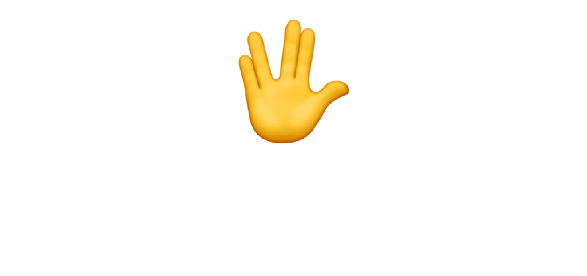

<div align="center">



### The VibeKit Onboard React Component Library

A React component library for seamless integration of VibeKit Onboard into your application.

---

[Website](https://vibekit.sh) • [Docs](https://docs.vibekit.sh) • [Discord](https://discord.com/invite/mhmJUTjW4b)

---
</div>


## Features

- 🚀 **Easy Integration** - Simple React components for quick setup
- 🎨 **Customizable UI** - Branded buttons and dialogs with your colors and logos
- 🔗 **GitHub Integration** - Connect repositories and create pull requests
- 📱 **Responsive Design** - Works seamlessly across all device sizes
- 🔐 **Authentication** - Secure GitHub OAuth integration
- ⚡ **TypeScript Support** - Full TypeScript support with type definitions

## Installation

### Package Manager

```bash
npm install @vibe-kit/onboard
# or
yarn add @vibe-kit/onboard
# or
pnpm add @vibe-kit/onboard
```

### Script Tags (CDN)

For quick prototyping or if you prefer not to use a build system, you can include VibeKit directly via script tags with a simple data-attribute approach:

```html
<!DOCTYPE html>
<html lang="en">
<head>
    <meta charset="UTF-8">
    <meta name="viewport" content="width=device-width, initial-scale=1.0">
    <title>VibeKit Example</title>
    
    <!-- Include VibeKit CSS -->
    <link rel="stylesheet" href="https://unpkg.com/@vibe-kit/onboard/style.css">
</head>
<body>
    <div class="min-h-screen p-8">
        <div class="flex flex-col items-center justify-center gap-8">
            <h1 class="text-3xl font-bold">Welcome to My App</h1>
            <div id="vibekit-button"></div>
        </div>
    </div>
    
    <!-- Include VibeKit Script Tag Bundle -->
    <script 
        src="https://unpkg.com/@vibe-kit/onboard/dist/script-tag.umd.js"
        data-agent-id="your-agent-token"
        data-element="#vibekit-button">
    </script>
</body>
</html>
```

**Data Attributes:**
- `data-agent-id` - Your agent token for authentication
- `data-element` - CSS selector for the element where the button should be rendered

This approach automatically initializes the VibeKit button without requiring React setup or manual component instantiation.

## Quick Start

### 1. Import the Components

```tsx
import { VibeKitProvider, VibeKitButton } from "@vibe-kit/onboard";
import "@vibe-kit/onboard/style.css";
```

### 2. Wrap Your App with the Provider

```tsx
function App() {
  return (
    <VibeKitProvider token="your-agent-token">
      <YourAppContent />
    </VibeKitProvider>
  );
}
```

### 3. Add the Button Component

```tsx
function YourAppContent() {
  return (
    <div>
      <h1>Welcome to My App</h1>
      <VibeKitButton />
    </div>
  );
}
```

## Usage

### Basic Implementation

```tsx
"use client";
import { VibeKitProvider, VibeKitButton } from "@vibe-kit/onboard";
import "@vibe-kit/onboard/style.css";

export default function Home() {
  return (
    <div className="min-h-screen p-8">
      <VibeKitProvider token="your-agent-token">
        <div className="flex flex-col items-center justify-center gap-8">
          <h1 className="text-3xl font-bold">Welcome to My App</h1>
          <VibeKitButton />
        </div>
      </VibeKitProvider>
    </div>
  );
}
```

### Advanced Configuration

The VibeKit components automatically adapt to your agent's configuration, including:

- **Custom Colors** - Uses your agent's primary color for the button
- **Branded Logos** - Displays your agent or project logo
- **Custom Text** - Shows your agent's custom button text and descriptions
- **GitHub Integration** - Handles repository selection and pull request creation

## Components

### VibeKitProvider

The main provider component that manages the VibeKit context and agent data.

**Props:**
- `token` (string, required) - Your agent token for authentication
- `children` (ReactNode, required) - Your app content

### VibeKitButton

The main button component that opens the onboarding dialog.

**Features:**
- Automatically styled with your agent's colors
- Shows your agent's logo (if configured)
- Opens a modal dialog with integration options
- Handles GitHub authentication
- Manages repository selection and integration

## API Reference

### VibeKitProvider Context

The provider exposes the following context values:

```tsx
interface VibeKitContextProps {
  token: string;
  agent: Agent | null;
  project: Project | null;
  loading: boolean;
  error: string | null;
  githubToken: string | null;
  isAuthenticated: boolean;
  isLoading: boolean;
  repositories: GitHubRepository[];
  login: (agentId: string) => Promise<void>;
  githubError: string | null;
}
```

### useVibeKit Hook

Access the VibeKit context in your components:

```tsx
import { useVibeKit } from "@vibe-kit/onboard";

function MyComponent() {
  const { agent, project, loading, error } = useVibeKit();
  
  if (loading) return <div>Loading...</div>;
  if (error) return <div>Error: {error}</div>;
  
  return (
    <div>
      <h2>{agent?.name}</h2>
      <p>{project?.description}</p>
    </div>
  );
}
```

## Styling

VibeKit Onboard uses Tailwind CSS for styling. The components are fully customizable and will automatically adapt to your agent's branding:

- **Primary Colors** - Applied to buttons and interactive elements
- **Logos** - Displayed in buttons and dialogs
- **Typography** - Uses your agent's custom text
- **Dark Mode** - Automatically supports dark mode themes

## Requirements

- React 18 or higher
- React DOM 18 or higher
- Tailwind CSS (for styling)

## Development

### Building the Library

```bash
# Install dependencies
npm install

# Build the library
npm run build

# Build CSS separately
npm run build:css
```

## Contributing

1. Fork the repository
2. Create a feature branch
3. Make your changes
4. Add tests if applicable
5. Submit a pull request

## License

This project is licensed under the MIT License.

## Support

For support and questions, please open an issue on GitHub or contact the VibeKit team.

---

Built with ❤️ by the VibeKit team
